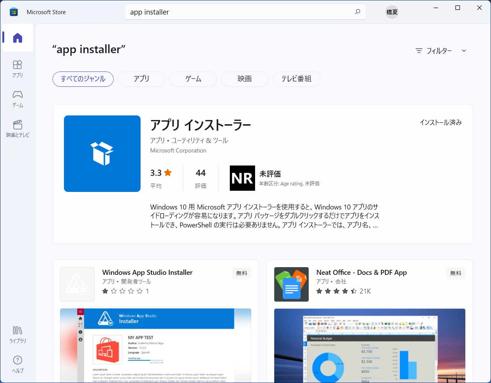

## Winget とは

Winget とは、Microsoft 社が提供する純正のパッケージマネージャのこと。

通常、デスクトップアプリケーションのインストールは、インストーラを起動し、
インストーラの案内にしたがって、ボタンで順次、選択してインストール作業を進めていく。

対して、Winget は、コマンドを一度発行するだけで、アプリのインストール完了まで、すべて自動で行ってくれる。

そのため、インストール作業を早く行うことができ、手順の間違いも起きにくい。

## Winget のインストール

まず Powershell やコマンドプロンプトで以下のコマンドを実行し、
Winget がインストールされているかどうかを確認する。

``` console
winget --version
```

インストールされていない場合は、Microsoft Store からインストールする。

Windows キーを押して、「Microsoft Store」と入力して、Microsoft Store を開く。

検索フォームに「app installer」と入力する。



「アプリ インストーラー」の「入手」をクリックすれば、インストールすることができる。

## Winget の使い方

### アプリの検索

search コマンドを使うことで、アプリを検索することができる。

``` console
winget search chrome
```

`コマンドの実行結果`
``` console
名前                       ID                         バージョン     一致                  ソース
-------------------------------------------------------------------------------------------------
Dichromate                 Dichromate.Browser         106.0.5249.103 Command: chrome       winget
Google Chrome Beta         Google.Chrome.Beta         107.0.5304.29  Command: chrome       winget
Google Chrome Dev          Google.Chrome.Dev          108.0.5343.2   Command: chrome       winget
Chrome Remote Desktop Host Google.ChromeRemoteDesktop 106.0.5249.37  Tag: chrome           winget
Ginger Chrome              Saxo_Broko.GingerChrome    93.0.4529.0                          winget
ICBCChromeExtension        ICBC.ICBCChromeExtension   1.2.0.0                              winget
360 极速浏览器X            360.360Chrome.X            21.0.1150.0                          winget
360极速浏览器              360.360Chrome              13.5.2036.0                          winget
115浏览器                  115.115Chrome              25.0.4.1                             winget
Google Chrome              Google.Chrome              106.0.5249.103                       winget
Google Chrome Canary       Google.Chrome.Canary       108.0.5347.0                         winget
Inssist                    SlashedIo.Inssist          16.1.0         Tag: chrome-extension winget
```

### アプリのインストール

install コマンドでアプリをインストールすることができる。

`-e --id` オプションを指定することで、ID を完全一致で指定してインストールすることになる。

``` console
winget install -e --id Google.Chrome
```

### その他

その他、winget list でシステムにインストールされているアプリの表示、  
winget upgrade でアプリの更新、
winget uninstall でアプリのアンインストールができる。
